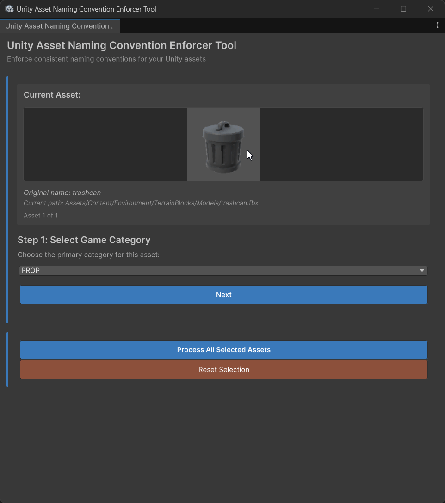

# Unity Asset Naming Convention Enforcer Tool

A Unity tool for enforcing consistent asset naming conventions through an automated wizard interface.

## Installation

### Via Git URL (Recommended)
1. Open Unity Package Manager
2. Click "+" → "Add package from git URL"
3. Enter: `https://github.com/razluta/UnityAssetNamingConventionEnforcerTool.git`

### Via Local Package
1. Clone this repository
2. In Unity Package Manager, click "+" → "Add package from disk"
3. Select the `package.json` file from the cloned repository

## Usage

1. Select one or more assets in the Project window
2. Open `Tools/Razluta/Unity Asset Naming Convention Enforcer Tool`
3. Follow the wizard:
   - **Single Asset**: Go through all steps (Category → Type → Review)
   - **Multiple Assets**: Set category and type once, then review each asset individually
   - Use "Reset This Asset" to restart the wizard for a specific asset
   - Review and edit the generated name for each asset
   - Apply the rename or skip assets as needed

## Naming Convention

Assets follow this format: `[GameCategory]_[AssetType]_[AssetName]_[Variant]_[State]_[Size/Quality]`

### Examples
- `CHAR_SkinnedModel_Knight_Male_Body_01`
- `WEAP_Model_Sword_Steel_Sharp_High`
- `ENV_Texture_Ground_Grass_Dry_2K`
- `GUI_Prefab_Button_Main_Normal_Large`

### Capitalization Rules
The tool automatically capitalizes the first letter of each word in the asset name components:
- Input: `"Dan maGICAL SwoRD FRom fire"` → Output: `"Dan_Magical_Sword_From_Fire"`
- Input: `"someWeirdCamelCase"` → Output: `"Some_Weird_Camel_Case"`

## Game Categories

- **CHAR** - Characters
- **WEAP** - Weapons
- **ENV** - Environment assets
- **PROP** - Props
- **GUI** - UI elements
- **AUDIO** - Sound effects and music
- **VFX** - Visual effects

## Asset Types

- **Prefab** - Unity prefabs
- **Model** - 3D models (FBX, OBJ, etc.)
- **SkinnedModel** - Rigged/animated models
- **Animation** - Animation clips
- **Animator** - Animator controllers
- **Texture** - Images and textures
- **Font** - Typography assets
- **Sound** - Audio clips (short)
- **Music** - Audio clips (long/background)
- **Curve** - Animation curves
- **Data** - ScriptableObjects and data files
- **Preset** - Unity presets
- **Template** - Template assets
- **Atlas** - Texture atlases
- **Light** - Lighting assets
- **AI** - AI behavior assets
- **Level** - Scene/level assets
- **Loc** - Localization files

## Features

- **Smart Batch Processing**: For multiple assets, set category and type once, then review each asset individually
- **Intelligent Name Processing**: Automatically detects variants, states, and quality markers
- **Consistent Capitalization**: Automatically capitalizes the first letter of each word component
- **Asset Preview**: Shows thumbnail previews of assets being renamed (models, textures, etc.)
- **File Type Detection**: Automatically suggests asset types based on file extensions
- **Real-time Validation**: Prevents invalid asset names
- **Name Breakdown**: Visual breakdown of how the final name is constructed
- **Flexible Workflow**: Reset individual assets to go through full wizard if needed
- **Modern UI**: Built with Unity's UIToolkit for a responsive interface

## Requirements

- Unity 2022.3 or higher
- UIToolkit support

## Version History

See [CHANGELOG.md](CHANGELOG.md) for detailed version history.

## Support

For issues, feature requests, or contributions, please visit the [GitHub repository](https://github.com/razluta/UnityAssetNamingConventionEnforcerTool).

## License

This tool is provided as-is for educational and commercial use. See the [repository](https://github.com/razluta/UnityAssetNamingConventionEnforcerTool) for specific license terms.